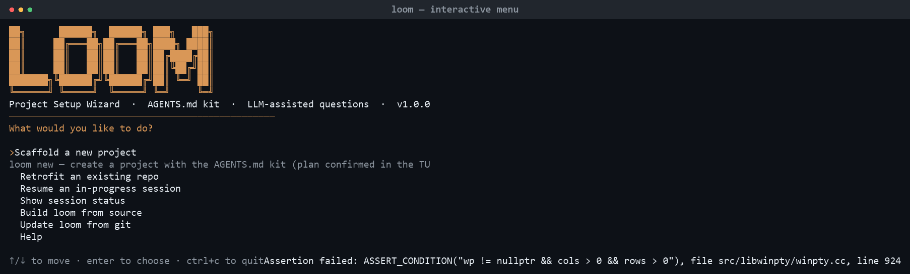
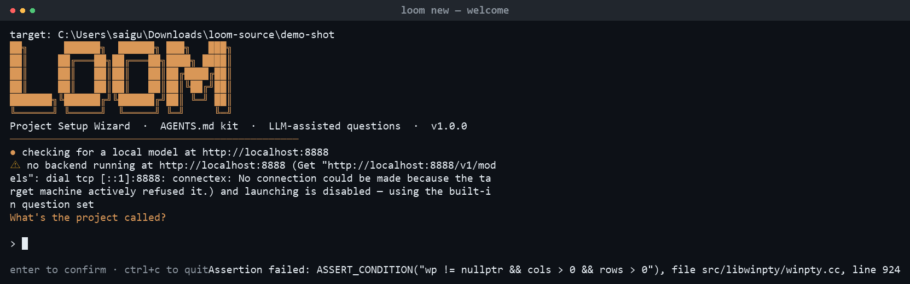
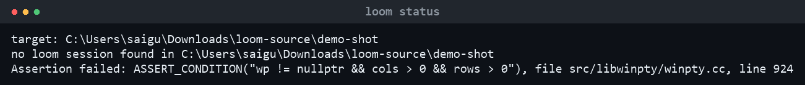
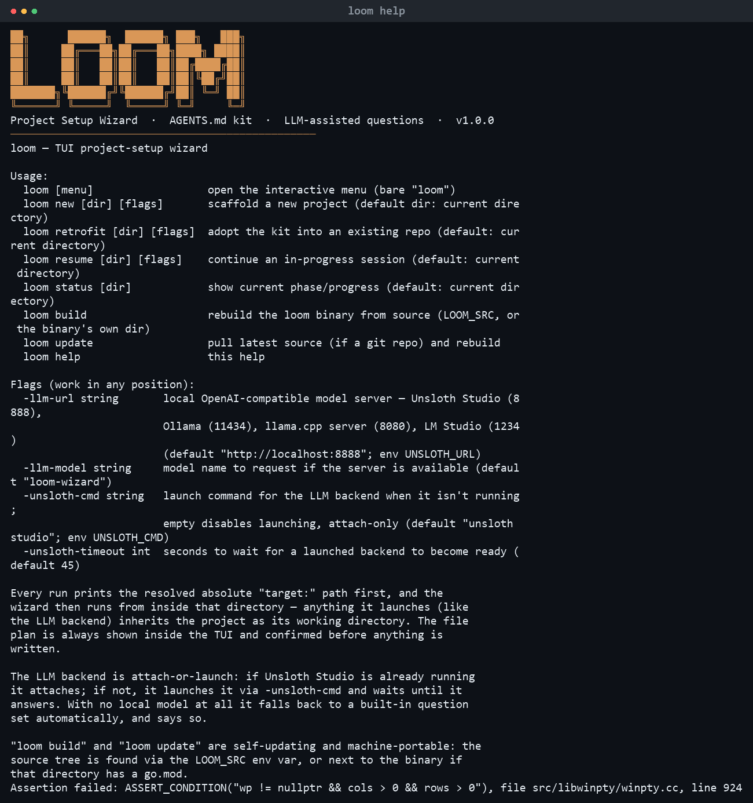

<div align="center">

# loom

**TUI project-setup wizard** — scaffolds the AGENTS.md kit into new or existing projects, with LLM-assisted questions and a built-in fallback. Install once, run from anywhere.


</div>

<p align="center">
  
</p>

---

## Install

Install once, then use `loom` anywhere. Three ways:

### 1. One-command installer (recommended, works everywhere)

Builds from source with the committed `go.sum`, so it works even where the
checksum DB hasn't indexed the module yet.

**PowerShell:**
```powershell
irm https://raw.githubusercontent.com/Gudapati-sai/loom/main/scripts/install.ps1 | iex
```

**bash / macOS / Linux:**
```bash
curl -sSL https://raw.githubusercontent.com/Gudapati-sai/loom/main/scripts/install.sh | bash
```

The installer puts `loom` in `$(go env GOPATH)/bin` and prints the PATH line
if that directory isn't on your PATH yet.

### 2. `go install` (the npm-equivalent, on machines with normal Go proxy access)

```bash
go install github.com/Gudapati-sai/loom@latest
export PATH="$PATH:$(go env GOPATH)/bin"    # one-time, bash
```

```powershell
go install github.com/Gudapati-sai/loom@latest
$env:PATH += ";$(go env GOPATH)\bin"        # one-time, current session
```

> **Brand-new module, sumdb 404?** `sum.golang.org` can take a few minutes
> to index a freshly published module. If you see
> `reading https://sum.golang.org/... 404 Not Found`, retry in a few
> minutes, or bypass verification for this one install:
> `GOSUMDB=off go install github.com/Gudapati-sai/loom@latest`.
> Pin a version with `@v1.0.0` for reproducibility.

### 3. Build from source

```bash
git clone https://github.com/Gudapati-sai/loom.git && cd loom && go build -o loom . && ./loom
```

```powershell
# PowerShell 5.1 has no '&&' — use ';' instead
git clone https://github.com/Gudapati-sai/loom.git; cd loom; go build -o loom.exe .; .\loom.exe
```

## Quick start

```
loom                  open the branded menu → pick an action
loom new ./demo       scaffold a project (file plan confirmed in the TUI first)
loom retrofit ./repo  add the kit to an existing project
loom status ./demo    show the saved session as JSON
loom resume ./demo    continue where you left off (never re-asks)
loom build            rebuild loom from source (any directory, any machine)
loom update           git pull (if a repo) then rebuild
loom help             usage
```

<p align="center">
  
  
</p>

## What a new project gets

The kit, written only after you confirm the plan in the TUI:

| File | Purpose |
|---|---|
| `AGENTS.md` · `.agent/skills/*` | Agent instructions + 7 skills (TDD loop, PR review, security… ) |
| `.ci/lint.yml` · `test.yml` · `security-scan.yml` | CI templates (ruff, pytest, bandit…) |
| `README.md` · `docs/prd/` · `docs/adr/` | Rendered readme, drafted feature PRD, ADR template |
| `.loom-state.json` | Resume state — `loom resume` continues exactly where you stopped |
| `.loom-log.md` · `.loom-trace.jsonl` | Answer provenance + machine-readable execution trace |

## LLM backend — attach-or-launch

loom never requires you to pre-start a model server:

1. **Attach** — if Unsloth Studio is already running at `http://localhost:8888/v1`, loom uses it.
2. **Launch** — if not, loom spawns `unsloth studio` detached (overridable with `-unsloth-cmd`), waits up to `-unsloth-timeout` seconds, then attaches. Its output lands in `.loom-unsloth.log` in the project.
3. **Fall back** — if no backend can be made available, loom warns and uses the built-in question set. Launching is an enhancement, never a blocker.

Compatible with any OpenAI-compatible server: Unsloth Studio (8888), Ollama (11434), llama.cpp `llama-server` (8080), LM Studio (1234) — point at it with `-llm-url` / `UNSLOTH_URL`.

## Color

Claude-inspired palette — terracotta `#D97757` accent, soft-gray secondary. Automatic clean **black & white** when output is piped, redirected, or `NO_COLOR=1` / `TERM=dumb`.

<p align="center">
  
</p>

## Commands & flags

Every command works from **any working directory**; the wizard prints the resolved absolute `target:` and runs from inside it. Full reference in **[COMMANDS.md](COMMANDS.md)** — flags, environment variables (`UNSLOTH_URL`, `UNSLOTH_CMD`, `LOOM_SRC`, `NO_COLOR`), runtime artifacts, exit codes.

## Testing

```bash
loom                    # menu renders
loom new ./demo         # plan screen → confirm → 13 files + PRD written
loom status ./demo      # session JSON
loom resume ./demo      # completes the session without re-asking
loom build              # self-rebuild (works while running on Unix; Windows swaps on exit)
loom update             # git pull + rebuild
```

Screenshots are generated from real captures — see `scripts/make-screenshot.ps1`.

## License

[MIT](LICENSE) © Gudapati Sai
